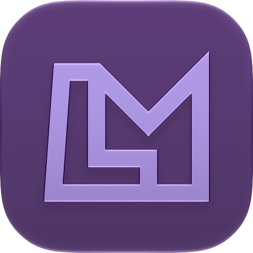

 

# LateMotion

Make your page to have motion design after it was already built

## Run the example

Requires Node.js 22.18 or newer and pnpm. Install dependencies with `pnpm install`, then run `task open` to log in to sites. Close that browser before running `task run` to reuse the login. Both commands use the persistent `.latemotion/profiles/main` browser profile, creating it automatically if needed. The profile is ignored by Git. The example scenario sets a 414×896 page viewport and opens [flipgo.tv](https://flipgo.tv). Complete any manual preparation, focus the browser, and press `p` to play the example scenario. The scenario clicks the About link.

Record the browser window with macOS screen recording tools when needed. Failures are written to `logs/trace.txt`. Run `task check` for a strict TypeScript check.

The example scenario is in `src/example.ts`. Its `before(page)` function sets the viewport and opens the initial URL before manual preparation. Scenario functions queue steps using `r.wait(milliseconds)`, `r.pointer.start(x, y)` with normalized viewport coordinates, `r.pointer.goto(selector)`, and `r.pointer.click()`. Pointer targets use the first visible DOM match for a selector.
